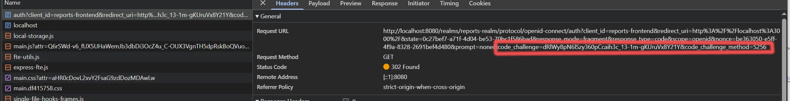
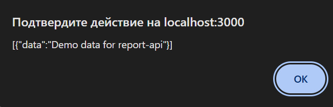
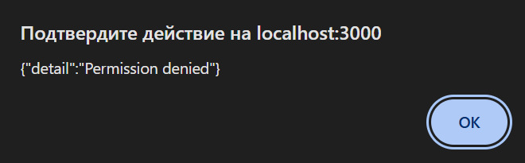
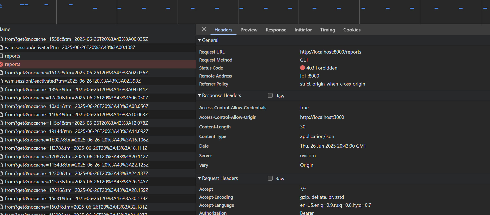
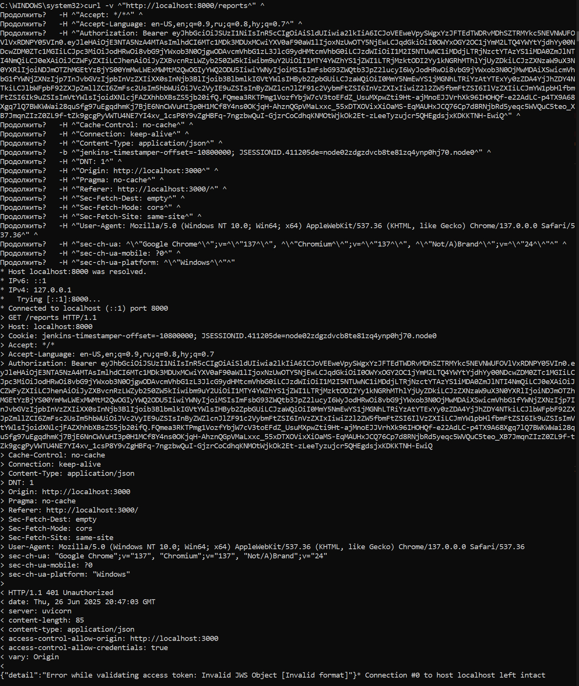
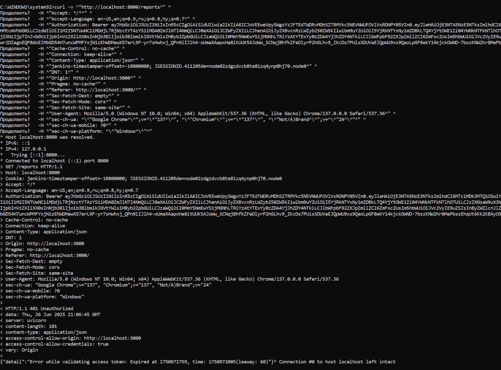

# Спринт 8 Кейс BionicPRO
Запустить готовое задание

```shell
docker compose up -d
```
## Task 1 Реализуйте PKCE
### Открыть приложение
В браузере http://localhost:3000
### Проверить работу PKCE (наличие code_verifier)

## Task 2 Создайте бэкенд-часть приложения для API
### Проверить работу бэкенда
#### 2.1 Перегазгрузить контейнер keycloak, чтобы сбросить текущие сессии
#### 2.2 Залогиниться под пользователем с ролью "prothetic_user" и скачать отчет
Будут возвращены данные из заглушки в API


#### 2.3 Перегазгрузить контейнер keycloak, чтобы сбросить текущие сессии
#### 2.4 Залогиниться под пользователем с ролью "user" и скачать отчет
Будет получена пользовательская ошибка



В сетевом логе видна ошибка 403 авторизации


#### 2.5 Попробовать передать испорченный токен

#### 2.6 Спустя 5 минут попробовать с тем же токеном повторить действие через curl
В ответ получена ошибка  401 валидации токена

